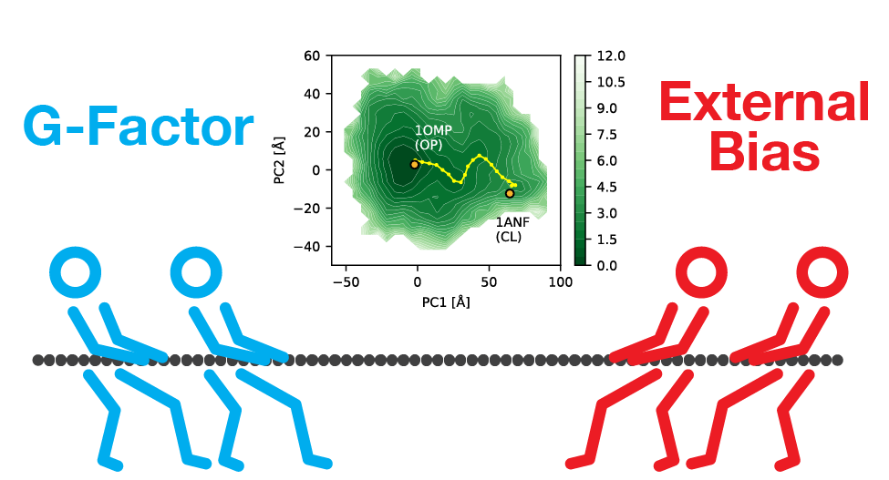

====
# G-factor-based external bias limiter (GERBIL)

## Overview
G-factor-based external bias limiter (GERBIL) is a scheme for regulating biased sampling  

## Description
To regulate biased sampling a well-established structural indicator (the G-factor) was used to obtain structural information. Based on the G-factor, we proposed a scheme for regulating biased sampling, which is referred to as a G-factor-based external bias limiter (GERBIL). With GERBIL, the configurations were structurally validated by the G-factor during biased sampling. As an example of biased sampling, an accelerated MD simulation (aMD) was adopted in GERBIL (aMD-GERBIL), whereby the aMD was repeatedly performed by increasing the strength of the boost potential.

## Requirement
・NAMD 3.0 package  
・Amber tools  
・Python 3.x (3.7.8)  
・MDAnalysis (2.1.0)  
・matplotlib (3.3.1)  
・pyEMMA (2.5.7)  
・numpy (1.19.1)　 

## Environment 
・These scripts are written as premises for multi-node computers with the queuing systems (qsub).  

## Usage
0 Preparation  
&nbsp;　0-1 File preparation:Put initial conformation(hoge.pdb) and parmeter file(hoge.prmtop) on ./gerbil_main/input/  
&nbsp;　0-2 Input parmeteres:write the number of residues and total number of atoms at the head of run_candi.sh  
&nbsp;`res_num=hoge  
name=hoge  
atoms=hoge`  
&nbsp;  
1 Conduct GERBIL  
&nbsp;`./run_gerbil.sh thresh_ini thresh_delta b_min b_max candi total_calculation_time(ns) `  
2 Calculated the FELs on the MSM constructions  
&nbsp;　2-0 Select initial structures for independently performed multiple long-time (5-ns) MD simulations from various configurations sampled by the aMD-GERBIL `clustering_with_PCA.ipynb`  
&nbsp;　2-1 Performed multiple long-time (5-ns) MD simulations `run_cluster.sh $num_of_candidates`  
&nbsp;　2-3 MSMs were constructed using the trajectories of the production MD runs the following scripts ①`Get_cluster_PCA.ipynb`,②`cluster_MSM.ipynb`  

## Install
Launch run_gerbil.sh and load input files. 

## Author 
Takunori Yasuda, Rikuri Morita, Yasuteru Shigeta, Ryuhei Harada.  
Center for Computational Sciences, University of Tsukuba  
takunoriyasuda@gmail.com

